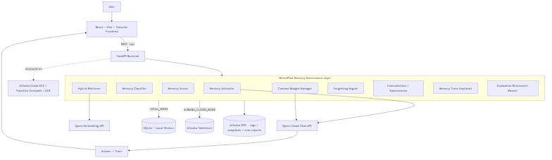

# MemoPilot IQ

> **A self-curating persistent-memory agent that remembers, forgets, and explains what matters.**

**Qwen Cloud Global AI Hackathon — Track 1: MemoryAgent**

MemoPilot IQ is a persistent-memory AI agent. Unlike a normal chatbot that only
sees recent chat history, it has a dedicated **memory intelligence layer
(MemoryOS)** that extracts structured memories from conversations, stores them
persistently, retrieves only the most relevant ones inside a strict token
budget, updates and supersedes outdated memories, expires temporary ones, and
shows a transparent **Memory Trace** explaining why each memory was used,
ignored, updated, or forgotten.

---

## Table of contents
1. [Executive summary](#executive-summary)
2. [Problem statement](#problem-statement)
3. [Key features](#key-features)
4. [Architecture](#architecture)
5. [How Qwen Cloud API is used](#how-qwen-cloud-api-is-used)
6. [How Alibaba Cloud is used](#how-alibaba-cloud-is-used)
7. [MemoryOS algorithm](#memoryos-algorithm)
8. [Forgetting engine](#forgetting-engine)
9. [Setup & local run](#setup--local-run)
10. [Environment variables](#environment-variables)
11. [Alibaba deployment](#alibaba-deployment)
12. [API docs](#api-docs)
13. [Testing](#testing)
14. [Demo script](#demo-script)
15. [Evaluation results](#evaluation-results)
16. [Judging criteria mapping](#judging-criteria-mapping)
17. [Screenshots](#screenshots)
18. [License](#license)

---

## Executive summary
MemoPilot IQ autonomously accumulates experience across conversations. It
remembers user preferences, project decisions, mistakes, goals, constraints and
deadlines, and makes increasingly accurate decisions across multi-turn and
cross-session interactions. It demonstrates sophisticated use of **Qwen Cloud**
APIs, an **Alibaba Cloud** persistence/deployment adapter, a custom memory scoring engine,
selective forgetting, a clean modular architecture, an evaluation benchmark, and
a transparent UI.

It runs in two modes:
- **LOCAL_MODE** — SQLite + in-process vectors; runs on a laptop with **no
  cloud keys** thanks to a deterministic offline fallback for Qwen.
- **ALIBABA_CLOUD_MODE** — Alibaba Cloud Tablestore + OSS, activated
  automatically when cloud credentials are present.

The current mode is always visible in the UI header and on `GET /health`.

## Problem statement
AI assistants forget everything between sessions. Developers and students
re-explain their stack, decisions and constraints repeatedly, and assistants
keep giving **outdated advice** after a decision changes (e.g. switching
frameworks). MemoPilot IQ fixes this with a persistent, self-curating memory
layer that knows what to remember, what to forget, and can prove its reasoning.

## Key features
> **Implementation note:** Memory priority never overrides the configured token
> budget; the reflection feature consolidates memories but does not train model
> weights; the diagnostic suite has 24 scenarios; and Alibaba deployment is
> considered complete only after a live deployment has been evidenced.

- 🧠 **Structured memory extraction** (12 types) via a Qwen "Memory Editor" — not raw chat logs.
- 🎯 **Custom scoring formula** blending semantics, importance, recency, usage, project match, criticality and penalties.
- 🔎 **Hybrid retrieval** — dense embeddings + sparse keyword/tag overlap + structured filters.
- 📏 **Context budget manager** — strict 2,500-token budget; critical/pinned memories are prioritized.
- ♻️ **Forgetting engine** — expire deadlines, archive stale memories, supersede contradicted decisions (non-destructive).
- 🪞 **Memory Trace** — see exactly which memories were injected/skipped, their scores, reasons and token cost.
- 📊 **Evaluation dashboard** — a 24-scenario diagnostic against a no-memory baseline.
- 🧠 **Reflection engine** — a self-improvement pass that merges duplicates, promotes frequently-used memories, and derives higher-level insights.
- 🕸️ **Live Memory Graph** — interactive visualization of memories with supersession/related edges, critical rings, and insight nodes.
- 📈 **Analytics dashboard** — memory growth, type/status distribution, forgetting rate, token savings.
- 🔒 **Secret-safe** — secrets are redacted before storage; never committed.
- ☁️ **Local ↔ Alibaba Cloud** dual mode with automatic fallback.
- ✅ **CI + Docker** — GitHub Actions (tests + build) and one-command `docker compose up`.
- 🏭 **Production platform** — optional API-key auth, per-key rate limiting,
  Prometheus `/metrics`, paginated + filtered memory API, per-memory audit
  history, and a two-stage rerank that keeps retrieval fast at 10⁵ memories.
- 🐍 **Python SDK** — embed MemoryOS in any agent in a few lines
  ([sdk/python](sdk/python/README.md)).
- 🔬 **LoCoMo harness** — evaluate on the standard long-conversation memory
  benchmark used by Mem0/Zep, with F1/EM grading and a model-independent
  evidence-recall metric ([docs/locomo.md](docs/locomo.md)).

## Architecture
See [docs/architecture.md](docs/architecture.md) for the full Mermaid diagram and
request lifecycle. Rendered diagram: [assets/architecture.svg](assets/architecture.svg)
(Mermaid source: [assets/architecture.mmd](assets/architecture.mmd)).



```
User → React + Vite frontend → FastAPI backend → MemoryOS
   MemoryOS → Qwen Cloud chat API
   MemoryOS → Qwen embedding API
   MemoryOS → Alibaba Tablestore (or SQLite locally)
   MemoryOS → Alibaba OSS (logs / snapshots / eval reports)
   MemoryOS → Context Builder → Qwen Cloud → Response + Trace
```

## How Qwen Cloud API is used
All AI calls go through [`backend/app/qwen_client.py`](backend/app/qwen_client.py)
against the DashScope OpenAI-compatible endpoint:
- **Chat / reasoning** — `qwen-plus` (configurable) generates the final answer
  from the budgeted memory context.
- **Memory extraction** — JSON-only "Memory Editor" prompt returns structured
  `new_memories`, `updates`, and `forget` actions.
- **Embeddings** — `text-embedding-v3` powers semantic retrieval.

If `QWEN_API_KEY` is unset, a deterministic offline implementation keeps the
whole app, tests and benchmark working end-to-end.

## How Alibaba Cloud is used
- **Tablestore** — persistent memory + event store ([`store_alibaba.py`](backend/app/memory/store_alibaba.py)).
- **OSS** — raw turn logs, memory snapshots, eval reports ([`oss_client.py`](backend/app/storage/oss_client.py)).
- **Deployment** — Docker image + `serverless.yaml` for ECS / Function Compute / ACK.
Full guide & proof checklist: [docs/deployment_alibaba.md](docs/deployment_alibaba.md).

## MemoryOS algorithm
Full detail (scoring weights, retrieval, extraction, states/types) in
[docs/memory_algorithm.md](docs/memory_algorithm.md). The scoring formula:

```
final_score = 0.40*semantic + 0.20*importance + 0.15*recency + 0.10*confidence
            + 0.10*usage + 0.15*project_match + 0.20*critical_bonus
            - 0.30*outdated - 0.25*privacy - 0.50*superseded
```

## Forgetting engine
Expires deadlines/temporary memories, archives unused low-importance memories
after 30 days, and supersedes contradicted decisions. Nothing is silently
hard-deleted — superseded/expired memories remain on the timeline but are never
injected into context. Users can Pin, Archive, Forget, Export, and Forget-all.

## Setup & local run

**Prerequisites:** Python 3.11+ and Node 18+.

### Backend
```bash
cd backend
python -m venv .venv
# Windows:
.venv\Scripts\activate
# macOS/Linux:
source .venv/bin/activate
pip install -r requirements.txt
uvicorn app.main:app --reload --port 8000
```

### Frontend
```bash
cd frontend
npm install
npm run dev      # http://localhost:5173 (proxies /api to :8000)
```

The frontend uses **React Router**:
- `/` — professional product landing page (hero, problem/solution, features,
  architecture flow, demo scenario, evaluation preview, hackathon compliance).
- `/app` — the MemoryAgent dashboard (Chat, Memory Trace, **Graph**, Timeline,
  **Analytics**, Evaluation, Controls, Settings), with a one-click **Judge
  Demo**. Reached via **Launch App**, with a **← Home** link back to the
  landing page.
- `/demo` — alias that redirects to `/app`.

### One command (both, from repo root)
```bash
npm install          # installs concurrently
npm run dev          # starts backend + frontend together
```

### Docker (full stack, one command)
```bash
docker compose up --build    # backend :8000 + frontend :5173
```
CI runs the backend tests and frontend build on every push — see
[.github/workflows/ci.yml](.github/workflows/ci.yml).

### Seed the scripted demo
```bash
# macOS/Linux:
cd backend && SEED_DEMO=1 uvicorn app.main:app --port 8000
# Windows PowerShell:
cd backend; $env:SEED_DEMO=1; uvicorn app.main:app --port 8000
```

No Qwen/Alibaba keys are required to run locally — the app starts in
`LOCAL_MODE` with the offline Qwen fallback.

## Environment variables
Copy [`.env.example`](.env.example) to `backend/.env` and fill in real values
(placeholders only in the example; `.env` is git-ignored).

| Variable | Purpose |
|---|---|
| `APP_MODE` | `local` or `alibaba` |
| `QWEN_API_KEY` / `QWEN_BASE_URL` | Qwen Cloud auth + endpoint |
| `QWEN_CHAT_MODEL` / `QWEN_EMBEDDING_MODEL` | Qwen models |
| `ALIBABA_ACCESS_KEY_ID/SECRET/REGION` | Alibaba Cloud credentials |
| `ALIBABA_OSS_BUCKET/ENDPOINT` | OSS storage |
| `ALIBABA_TABLESTORE_ENDPOINT/INSTANCE` | Tablestore memory store |
| `MEMORY_STORE` | `sqlite` or `alibaba` |
| `DATABASE_URL` | SQLite path for local mode |
| `FRONTEND_ORIGIN` | CORS origin for the frontend |

## Alibaba deployment
See [docs/deployment_alibaba.md](docs/deployment_alibaba.md) for ECS (Docker),
Function Compute (`serverless.yaml`) and ACK instructions, plus the proof
checklist (health screenshot, Tablestore rows, OSS objects).

## API docs
Interactive OpenAPI docs at `http://localhost:8000/docs`.

| Method | Path | Description |
|---|---|---|
| GET | `/health` | Status, mode, Qwen/store configuration |
| POST | `/api/chat` | Memory-augmented chat; returns answer + used memories + actions + trace + mode |
| GET | `/api/memories` | List memories by user/project |
| POST | `/api/memories` | Create a memory manually |
| PATCH | `/api/memories/{id}` | Pin / archive / edit / change status |
| DELETE | `/api/memories/{id}` | Delete (soft by default, `?hard=true` to remove) |
| GET | `/api/memories/timeline` | Memory event timeline |
| GET | `/api/memories/export` | Export memories as JSON |
| POST | `/api/memories/forget-all` | Clear all memories for a project |
| POST | `/api/memory/extract` | Run extraction manually |
| GET | `/api/memories/{id}/history` | Per-memory audit trail (all lifecycle events) |
| GET | `/metrics` | Prometheus metrics (requests, latency, 401/429 counters) |
| POST | `/api/eval/run` | Run the benchmark |
| POST | `/api/eval/ablation` | Run the governance ablation study |
| GET | `/api/eval/report` | Latest evaluation report |

**Production hardening** (all optional, zero-friction locally): set
`MEMOPILOT_API_KEYS=key1,key2` to require an `X-API-Key` header on `/api/*`,
and `RATE_LIMIT_PER_MINUTE` (default 120) for per-key/IP rate limiting.
`GET /api/memories` supports `type`, `status`, `q` (text search), `limit`,
`offset`. See [sdk/python](sdk/python/README.md) for the embeddable client.
| POST | `/api/demo/run` | Run the scripted 4-session judge demo |
| GET | `/api/trace/{session_id}` | Latest Memory Trace for a session |
| POST | `/api/reflect` | Run the reflection / consolidation pass |
| GET | `/api/analytics` | Aggregate memory analytics |
| GET | `/api/graph` | Memory graph nodes + edges |

## Testing
```bash
cd backend
python -m pytest
```
Frontend type-check / build:
```bash
cd frontend && npm run build
```

## Demo script
The under-3-minute walkthrough is in [docs/demo_script.md](docs/demo_script.md).
The Chat tab has four starter buttons that replay the 4-session demo.

## Evaluation results
Run **Evaluation → Run benchmark** in the UI, or `POST /api/eval/run`.
The report records the configured model, strict keyword evaluator, retrieval
depth, context recall, stale-memory leaks, historical-context token reduction,
and latency for that run. Results depend on the selected model and are not
hard-coded in the landing page. See
[docs/evaluation_results.md](docs/evaluation_results.md) for the protocol and
reporting checklist.

## Judging criteria mapping
See [docs/judging_mapping.md](docs/judging_mapping.md) for the full rubric and
rule-compliance checklist.

## Screenshots
Before submission, add captures of the **landing page** (`/`), Chat + Trace,
Timeline, Evaluation dashboard, and a real Alibaba `/health` response to
`assets/`. Do not add cloud-proof captures until the deployment is live.

## License
[MIT](LICENSE).
