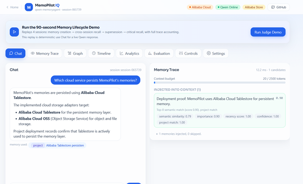
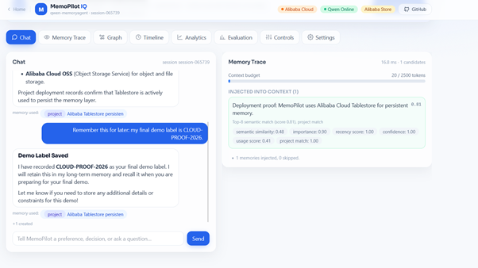
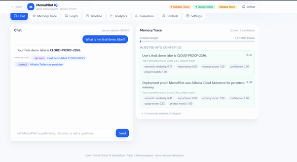

# Alibaba Cloud Deployment Proof

MemoPilot IQ is deployed on **Alibaba Cloud ECS** in
`ALIBABA_CLOUD_MODE`. The deployment uses Qwen Cloud / DashScope for model
calls, Alibaba Tablestore for durable memory, and Alibaba OSS for redacted turn
snapshots and evaluation artifacts.

The public demonstration URL is the secured
[HTTPS deployment](https://47-84-129-218.sslip.io/app). `GET /health` exposes
the deployed build SHA, active storage backend, schema, Qwen status, and tenant
isolation mode without exposing credentials.

## 1. Retrieved memory from Alibaba Tablestore

The public app answers a cloud-storage question using an injected, scored
Tablestore memory. The header shows Alibaba Cloud, Qwen Online, and Alibaba
Store.

## 2. Automatic memory creation

An explicit user request stores `CLOUD-PROOF-2026`. The `+1 created` action is
visible beneath the chat response.

## 3. Cross-session recall

A new session asks for the demo label. MemoPilot recalls the exact value and
Memory Trace shows the automatically created record among the injected
candidates.

## Code evidence

- [`backend/app/qwen_client.py`](../backend/app/qwen_client.py) — DashScope
  OpenAI-compatible chat, JSON extraction, and embedding calls.
- [`backend/app/memory/store_alibaba.py`](../backend/app/memory/store_alibaba.py)
  — Alibaba Tablestore persistence for memories and events.
- [`backend/app/storage/oss_client.py`](../backend/app/storage/oss_client.py)
  — Alibaba OSS snapshots and evaluation artifacts.
- [`deploy/ecs_deploy.sh`](../deploy/ecs_deploy.sh) — Docker deployment on ECS.

No credentials, access keys, or private-console details are included in this
proof package.
