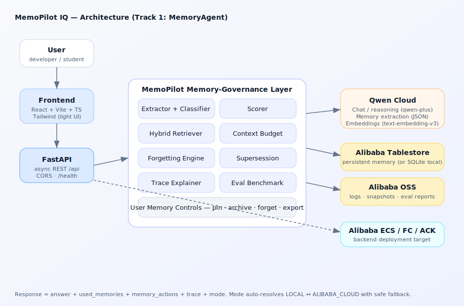
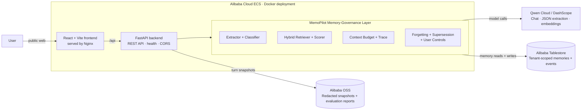

# Deployed Architecture — MemoPilot IQ

MemoPilot IQ is deployed on **Alibaba Cloud ECS**. The public React frontend
and FastAPI backend run as Docker containers on the ECS instance. Every memory
decision passes through the MemoPilot memory-governance layer, which is the
only layer allowed to call Qwen Cloud or persistent Alibaba Cloud services.

## Request lifecycle (`POST /api/chat`)

1. **Receive** — Nginx serves the React application and proxies `/api` calls to
   FastAPI on the same Alibaba Cloud ECS instance.
2. **Govern** — the memory layer runs lifecycle rules, then retrieves active,
   user/project-scoped records through a Tablestore composite-key range query.
3. **Retrieve and score** — Qwen embeddings, sparse keyword overlap, memory
   metadata, recency, importance, confidence, and project scope are combined
   into an explainable score.
4. **Budget** — ContextBuilder injects only the highest-value memories that fit
   the hard 2,500-token context budget; every inclusion and skip is recorded in
   Memory Trace.
5. **Reason** — Qwen Cloud / DashScope produces the answer from the governed
   context.
6. **Learn** — the Memory Editor extracts durable memories, redacts
   secret-like values, detects contradictions, and creates supersession events.
7. **Persist** — memory records and audit events are written to Alibaba
   Tablestore. Redacted turn snapshots and evaluation reports are sent to
   Alibaba OSS.
8. **Explain** — FastAPI returns the answer, used-memory list, lifecycle
   actions, and complete Memory Trace to the frontend.

## Deployed Alibaba Cloud services

| Service | Responsibility | Implementation |
|---|---|---|
| Alibaba Cloud ECS | Public Docker runtime for frontend and backend | [`deploy/ecs_deploy.sh`](../deploy/ecs_deploy.sh) |
| Qwen Cloud / DashScope | Chat, structured memory extraction, embeddings | [`backend/app/qwen_client.py`](../backend/app/qwen_client.py) |
| Alibaba Tablestore | Persistent memories and lifecycle audit events | [`backend/app/memory/store_alibaba.py`](../backend/app/memory/store_alibaba.py) |
| Alibaba OSS | Redacted turn snapshots and evaluation artifacts | [`backend/app/storage/oss_client.py`](../backend/app/storage/oss_client.py) |

The diagram intentionally shows the submitted **Alibaba Cloud deployment**. It
does not depict developer-only fallback storage, so judges can see the exact
cloud architecture demonstrated in the proof screenshots.
