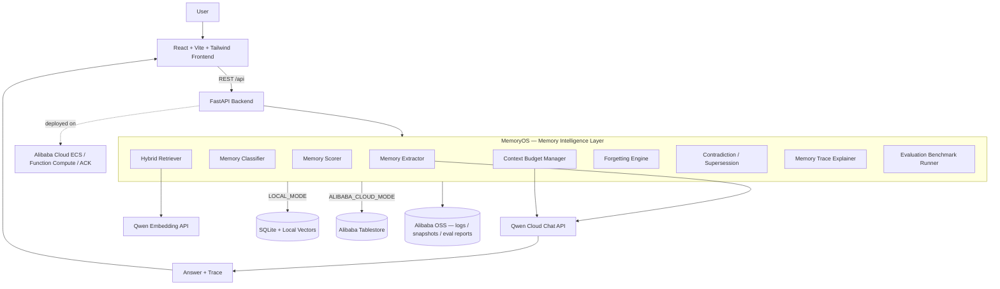

# Architecture — MemoPilot IQ

MemoPilot IQ separates a thin chat surface from a dedicated **memory
intelligence layer (MemoryOS)**. The frontend never talks to memory storage
directly; every decision flows through MemoryOS, which is the only component
that talks to Qwen Cloud and to the persistent store.



## Request lifecycle (POST /api/chat)

1. **Forgetting sweep** — expire deadlines/temporary memories, archive stale
   low-importance memories (`memory/forgetting.py`).
2. **Embed query** — Qwen embedding endpoint (offline hashing fallback).
3. **Hybrid retrieve** — dense cosine + sparse keyword overlap + structured
   filters (`user_id`, `project_id`, status), critical/pinned prioritised
   (`memory/retriever.py`).
4. **Score** — the MemoryOS scoring formula (`memory/scorer.py`).
5. **Budget** — ContextBuilder injects within a 2,500-token budget, prioritising
   critical/pinned records only when they fit (`memory/context_builder.py`).
6. **Answer** — Qwen chat with the budgeted system prompt.
7. **Extract** — the Memory Editor extracts new structured memories, detects
   contradictions → supersession, redacts secrets (`memory/extractor.py`).
8. **Snapshot** — turn persisted to OSS (or local snapshot).
9. **Respond** — `answer`, `used_memories`, `memory_actions`, `trace`, `mode`.

## Storage modes

| | LOCAL_MODE | ALIBABA_CLOUD_MODE |
|---|---|---|
| Metadata | SQLite (`store_sqlite.py`) | Tablestore (`store_alibaba.py`) |
| Vectors | in-process cosine | embedding stored per row |
| Logs/snapshots | `./snapshots/*.json` | Alibaba OSS bucket |
| Selected when | default / no cloud keys | `MEMORY_STORE=alibaba` + creds present |

The mode is resolved in `config.Settings.resolved_mode()` and surfaced on
`GET /health` and in the UI header, with automatic fallback to local if cloud
SDKs/credentials are missing.

To regenerate a PNG from the Mermaid source:

```bash
npx -y @mermaid-js/mermaid-cli -i assets/architecture.mmd -o assets/architecture.png
```
