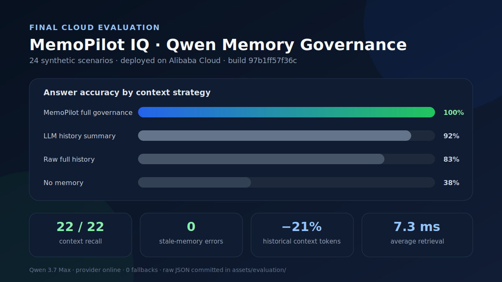

# Final Evaluation Results

The final evidence was generated on **2026-07-19** by Alibaba Cloud deployment
[`97b1ff57f36c`](https://github.com/MaharMuavia/memopilot-iq/commit/97b1ff57f36c)
using **Qwen 3.7 Max** for chat and **text-embedding-v3** for embeddings.
Provider status was `online` with **zero fallbacks**.

## Answer-quality comparison

All four strategies answered the same 24 synthetic scenarios. The scenarios
cover preferences, cross-session recall, supersession, expiry, critical
constraints, mistake/deadline recall, and multi-fact composition.

| Strategy | Accuracy |
|---|---:|
| **MemoPilot full governance** | **100% (24/24)** |
| Model-generated history summary | 92% |
| Raw full conversation history | 83% |
| No memory | 38% |

Additional observed metrics:

| Metric | Result |
|---|---:|
| Recall in admitted context | **100% (22/22 recall-bearing cases)** |
| Outdated-memory errors | **0** |
| Historical-context tokens | 256 vs. 323 raw-history tokens (**21% reduction**) |
| Average retrieval latency | **7.3 ms** |
| Provider-reported total tokens for the complete evaluation job | 44,508 |

Raw report:
[`final-qwen-eval-2026-07-19-97b1ff57f36c.json`](../assets/evaluation/final-qwen-eval-2026-07-19-97b1ff57f36c.json)

## Memory-layer ablation

The ablation holds the scenario memories constant and changes only the context
assembly strategy. It makes **zero final-answer model calls**. Latency is the
in-process assembly time after embeddings are available.

| Variant | Context recall | Stale leak | Lifecycle safety | Avg context tokens |
|---|---:|---:|---:|---:|
| Full conversation history | 100% | 33% | 67% | 13.5 |
| **MemoPilot full governance** | **100%** | **0%** | **100%** | **11.3** |
| Dense-only + lifecycle exclusion | 100% | 0% | 100% | 11.3 |
| Recency-only + lifecycle exclusion | 100% | 0% | 100% | 11.3 |
| Hybrid without lifecycle exclusion | 100% | 21% | 79% | 14.4 |

The result isolates the most important contribution: **lifecycle exclusion
prevents stale decisions from entering context**. It does not claim that the
ranking formula is universally better than dense or recency ranking on this
small diagnostic suite.

Raw report:
[`final-ablation-2026-07-19-97b1ff57f36c.json`](../assets/evaluation/final-ablation-2026-07-19-97b1ff57f36c.json)

## Grading and reproducibility

- The answer evaluator is `deterministic-phrase-negation-v2`.
- Expected concepts and declared aliases must be present.
- Alphanumeric boundaries prevent substring errors such as treating `npm` as
  present inside `pnpm`.
- A rejected alternative (for example, “avoid dark”) is not counted as a stale
  recommendation.
- Each scenario includes its Qwen answer, context-recall flag, and any grading
  failure reason in the raw JSON.
- The deployed build SHA, model names, provider status, fallback count, token
  usage, evaluator version, scenario count, and run duration are embedded in
  the raw report.

This is a project diagnostic, not a claim of general long-context benchmark
superiority. Archived LoCoMo experiments remain documented separately and are
not used as headline submission evidence.
